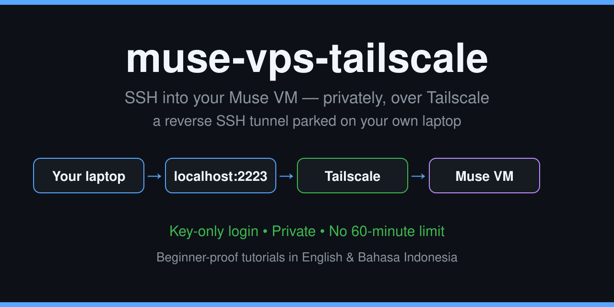

# muse-vps-tailscale




> 🇬🇧 English version: [README.md](README.md)

**SSH ke VM Muse kamu sendiri — privat lewat Tailscale, pakai kunci
tanpa password, dan tanpa batas 60 menit. Pintunya dititipkan di laptop
kamu sendiri.**

---

<div align="center">

## 🎁 BELUM PUNYA MUSE? KLAIM BONUS 1 MILIAR TOKEN

### Kode referral: `IB4FJR`

Tukarkan kode ini di Settings Muse **dalam 48 jam setelah bergabung** dan
kita berdua mendapatkan **1 miliar token Muse**.

**👉 [Baca tutorial klaim Muse — pakai VPN & tanpa VPN](docs/CLAIM-MUSE.id.md)**

</div>

---

Dokumen ini ditulis buat **orang yang sangat awam**. Nggak apa-apa kalau
kamu baru pertama kali dengar istilah-istilah di sini — semuanya dijelasin
pelan-pelan dari nol. Baca dari atas ke bawah, jangan loncat-loncat dulu.

---

## 1. Penjelasan 30 detik (bahasa bayi)

Bayangin VM Muse kamu itu sebuah **rumah yang teleponnya rusak
sebagian**:

- Telepon di rumah itu **cuma bisa nelepon keluar, nggak bisa
  ditelepon**. Nggak ada nomor publiknya, dan nggak ada yang bisa
  datang berkunjung.
- Padahal kamu — pemiliknya — pengen **masuk ke rumah itu beneran**,
  bukan cuma ngobrol sama penghuninya lewat jendela (chat).

Project ini ngakalinnya begini:

1. Rumah itu **nelepon laptop kamu** lewat jaringan privat Tailscale,
   dan teleponnya **dibiarkan tersambung terus**.
2. Lewat sambungan yang terbuka itu, rumahnya **nitip satu pintu
   kecil di laptop kamu** — nomornya `2223`.
3. Kamu tinggal masuk **lewat pintu titipan di laptop kamu sendiri**.
   Kelihatannya kamu masuk ke laptop sendiri, padahal kamu diteruskan
   lewat sambungan tadi dan mendaratnya **di dalam VM Muse**.

Pintu titipan itu namanya **reverse SSH**. Yang bisa membukanya cuma
satu kunci yang kamu pegang. Nggak ada alamat publik, nggak ada
perusahaan perantara, dan **nggak ada hitungan mundur 60 menit**.

## 2. Kenapa orang mau pakai ini?

- Kamu mau **pegang terminal VM Muse kamu sendiri** — belajar Linux,
  ngecek file, jalanin perintah — bukan cuma chat sama agent-nya
- Kamu sudah coba jalur tunnel publik gratisan (penulis pakai Pinggy)
  dan capek sama **batas 60 menit + alamat yang ganti tiap nyala**
- Kamu mau jalurnya **privat**: cuma perangkat di jaringan Tailscale
  kamu yang bisa ikutan, bukan seluruh internet
- Kamu mau login **tanpa password sama sekali** — diganti kunci, yang
  jauh lebih kuat dan nggak bisa ditebak-tebak orang
- Kamu mau pintunya **sembuh sendiri sesudah VM di-reset** — penjaga
  auto-recovery menyalakan lagi sisi VM dalam waktu kira-kira 1
  menit, sendiri, tanpa kamu perlu nyuruh siapa-siapa (Bagian 4 di
  tutorial)

## 3. Siapa yang cocok pakai ini, siapa yang nggak

**Cocok buat kamu kalau:**

- Kamu punya akun **Muse** (agent-nya tinggal di VM yang mau kamu
  masuki). Belum punya? Ada [tutorial klaimnya](docs/CLAIM-MUSE.id.md)
- Kamu punya **laptop Windows** yang bisa nyala selama kamu mau sesi
  SSH-nya hidup, dan kamu pegang akses Administrator-nya
- Kamu bisa copy-paste perintah dan baca pelan-pelan

**Nggak cocok / jangan pakai kalau:**

- Kamu butuh masuk ke VM **saat laptop kamu mati**. Jalur ini titik
  temunya laptop kamu — laptop mati, pintunya ikut nggak ada. (Buat
  yang itu, tunnel publik kayak Pinggy lebih cocok; lihat Bab 8)
- Kamu nggak mau memasang apa pun di laptop kamu. Sisi laptop ada
  setup sekali jalan (firewall + satu kunci) — memang nggak bisa
  diskip, tapi permanen sesudahnya
- VM kamu ternyata **bisa** dihubungi langsung lewat Tailscale (punya
  routing Tailscale asli). Kalau begitu kamu beruntung — SSH langsung
  saja ke IP tailnet VM-nya, kamu nggak butuh putaran reverse ini

## 4. Kamus kecil (istilah yang bakal sering muncul)

Baca ini dulu biar nggak bingung di tengah jalan:

| Istilah | Artinya pakai bahasa manusia |
|---|---|
| **VM** | Komputer virtual — "rumah" tempat agent Muse kamu tinggal |
| **SSH** | Cara aman masuk ke komputer lain dari jauh, pakai terminal |
| **sshd** | Program penjaga pintu SSH di sebuah mesin. Yang kamu masuki itu sshd; yang nelepon keluar itu klien ssh |
| **Kunci (key pair)** | Sepasang file: **kunci privat** (anak kunci, rahasia, kamu pegang) dan **kunci publik** (gembok, boleh disebar, dipasang di mesin tujuan) |
| **Tailscale** | Program yang bikin jaringan privat antar perangkat kamu, walau mereka tersebar di internet |
| **Tailnet** | Nama jaringan privat Tailscale kamu itu. Cuma perangkat yang kamu setujui yang bisa gabung |
| **IP Tailscale** | Alamat `100.x.x.x` tiap perangkat di dalam tailnet |
| **Reverse SSH** | SSH yang arahnya dibalik: mesin yang mau dimasuki justru nelepon keluar ke mesin kamu, sambil menitipkan port |
| **Port titipan** | Nomor port di laptop kamu (standarnya `2223`) yang isinya diteruskan ke VM |
| **Supervisor / pengawas** | Script kecil yang menjaga tunnel: kalau putus, dia menyalakannya lagi tiap 10 detik |
| **Firewall** | Satpam jaringan di Windows. Dia yang mutusin koneksi mana yang boleh masuk |
| **Shields Up** | Mode paranoid Tailscale: semua koneksi masuk diblokir. Harus mati buat project ini |
| **Pinggy** | Layanan tunnel publik (yang dipakai penulis sebelumnya): VM nelepon ke server perusahaan itu, kamu dikasih alamat publik sementara |
| **Token** | Satuan "bahan bakar" mikirnya AI. Muncul di repo ini cuma di blok bonus referral |

## 5. Yang harus kamu punya dulu (cek satu-satu)

Jangan mulai pasang sebelum semua ini centang:

- [ ] **Satu akun Muse** yang aktif — VM-nya yang mau kamu masuki.
  Belum punya? Ikuti [tutorial klaim Muse](docs/CLAIM-MUSE.id.md) —
  ada jalur VPN dan tanpa VPN — lalu tukarkan kode referral
  **`IB4FJR`** dalam 48 jam buat bonus 1 miliar token
- [ ] **Satu laptop Windows** dengan akses **Administrator**, dan kamu
  bisa membiarkannya menyala selama sesi SSH
- [ ] **Tailscale terpasang di laptop** dan sudah login pakai akun
  kamu (akun Tailscale gratis cukup)
- [ ] **OpenSSH Client bawaan Windows jalan** — CMD kamu bisa jalanin
  perintah `ssh` dan `ssh-keygen` (bawaan Windows 10/11 biasanya bisa)
- [ ] Kamu siap jalanin **setup sekali jalan di laptop** (Bagian 1 di
  tutorial): cek SSH Server, satu baris firewall, satu kunci ditempel

Kalau ada yang belum centang, selesaikan yang kurang dulu, baru balik
ke sini. Urutannya memang penting.

## 6. Isi repo ini, file per file

Biar kamu nggak takut sama foldernya — ini semua isinya dan gunanya:

| File / folder | Gunanya, bahasa manusia |
|---|---|
| `README.md` | Dokumen ini versi Bahasa Inggris |
| `README.id.md` | Dokumen ini (yang lagi kamu baca) |
| `docs/TUTORIAL.id.md` | **Tutorial lengkap Bahasa Indonesia, langkah demi langkah dua sisi** — bacaan utama buat masang |
| `docs/TUTORIAL.md` | Tutorial yang sama versi Bahasa Inggris |
| `docs/CLAIM-MUSE.id.md` | **Tutorial klaim akun Muse pakai VPN & tanpa VPN**, lengkap dengan highlight kode referral `IB4FJR` |
| `docs/CLAIM-MUSE.md` | Tutorial klaim Muse yang sama versi Bahasa Inggris |
| `docs/images/banner.svg` | Gambar judul di atas |
| `scripts/setup-sshd.sh` | **Pemasang sshd di sisi VM** — bikin sshd key-only di localhost port 2222 dari file contoh |
| `scripts/sshd_config.example` | Contoh konfigurasi sshd-nya (password mati, cuma localhost, cuma kunci) |
| `scripts/reverse-start.sh` | **Penyalanya** — menjalankan tunnel reverse dari VM ke laptop, dijaga pengawas |
| `scripts/reverse-supervisor.sh` | **Si pengawas** — membuka ssh reverse-nya dan menyalakan lagi tiap 10 detik kalau putus |
| `scripts/reverse-stop.sh` | **Pemadamnya** — mematikan tunnel + pengawasnya sekaligus |
| `scripts/ensure-up.sh` | **Si penjaga sembuh-sendiri** — memeriksa Tailscale, binary sshd, sshd lokal, dan supervisor berurutan, lalu membetulkan apa pun yang dibunuh reset VM; nggak ngapa-ngapain kalau semua sehat |
| `scripts/ensure-hook.sh` | **Skrip penjadwalnya** — memanggil si penjaga tiap 30 detik dari hook runtime penulis dan membangunkan agent cuma sekali per kejadian beneran |
| `scripts/ssh-tunnel-ensure.hook.json.example` | **Contoh definisi hook** — jadwal polling 30 detik plus kerangka prompt bangun buat si penjaga |
| `scripts/tsconnect.py` | Alat kecil ProxyCommand: mengantar koneksi ssh VM masuk ke tailnet lewat proxy runtime (dibutuhkan di sandbox penulis; lihat catatan di tutorial) |
| `scripts/windows-setup.ps1` | **Script penyiap laptop Windows** — cek admin, cek sshd, minta kunci publik VM, pasang aturan firewall + kunci + izin file-nya |
| `LICENSE` | Lisensi MIT |

## 7. Cara pasang — gambaran langkah besarnya

Detailnya ada di tutorial (link di bawah). Bentuk besarnya begini:

**Sisi laptop (sekali jalan, permanen):**

1. Catat IP Tailscale laptop (`tailscale ip -4`)
2. Pastikan SSH Server Windows **jalan** (`sc query sshd` → RUNNING)
3. Bikin **kunci kamu sendiri** (`ssh-keygen`), kirim yang `.pub` ke VM
4. Buka **firewall** khusus buat range Tailscale
   (`remoteip=100.64.0.0/10`) — bisa sekaligus dikerjakan
   `scripts/windows-setup.ps1`
5. Tempel **kunci publik VM** di laptop + kunci izin file-nya
6. Pastikan **Allow incoming connections** nyala (Shields Up mati)

**Sisi VM Muse:**

7. Jalankan `setup-sshd.sh` — sshd key-only nyala di localhost:2222,
   kunci publik kamu ditempel di `authorized_keys`
8. Gabungkan VM ke tailnet kamu (`tailscale up`, kamu yang setujui
   link-nya — **ada trik penting kalau link-nya nggak keluar**, dibahas
   di tutorial)
9. Tes jalan VM → laptop (harus tembus sesudah langkah 4–6 beres)
10. Jalankan `reverse-start.sh` — port titipan `2223` muncul di laptop,
    dijaga pengawas

**Koneknya (tiap hari):**

```
ssh -i muse-key -p 2223 root@127.0.0.1
```

Tutorial lengkapnya:

- 🇮🇩 **[docs/TUTORIAL.id.md](docs/TUTORIAL.id.md)** — Bahasa Indonesia,
  bahasa bayi, pemula pasti bisa
- 🇬🇧 **[docs/TUTORIAL.md](docs/TUTORIAL.md)** — English version

**Dan dia sembuh sendiri sesudah reset (auto-recovery).** Reset VM
tetap mematikan sshd dan supervisor yang sedang jalan — tapi
sekarang setup-nya nggak nunggu manusia lagi. Skrip penjaga
(`scripts/ensure-up.sh`) memeriksa Tailscale → binary sshd → sshd
lokal → supervisor dan membetulkan yang rusak, dipanggil tiap 30
detik oleh hook runtime yang tinggal di `$HOME` — satu-satunya
tempat yang nggak bisa dihapus reset. Perbaikannya sendiri murni
bash (**nol token AI**); agent cuma dibangunkan sekali per kejadian,
buat verifikasi dan lapor. Sesudah reset: **tunggu kira-kira 1
menit, lalu konek kayak biasa.** Cerita lengkapnya — termasuk satu
batas jujurnya (Tailscale yang logout total tetap butuh persetujuan
kamu) dan satu bug flock beneran yang layak diketahui — ada di
Bagian 4 tutorial.

## 8. Dibandingin sama Pinggy (jalur lama penulis)

Penulis project ini awalnya masuk ke VM Muse-nya lewat **Pinggy**
(tunnel publik gratisan). Itu terbukti jalan — dan tetap jadi jalur
cadangan yang bagus. Bedanya:

| Hal | Pinggy (publik) | Project ini (Tailscale reverse) |
|---|---|---|
| Titik temu | Server perusahaan Pinggy | **Laptop kamu sendiri** |
| Alamat buat konek | Publik, **acak, ganti tiap nyala** | `127.0.0.1:2223` di laptop — tetap |
| Batas waktu | **60 menit** per sesi (gratisan) | **Nggak ada** — selama laptop online |
| Siapa yang bisa nyoba konek | Siapa aja yang tahu alamatnya (tetap ketahan kunci) | Cuma perangkat di tailnet kamu |
| Setup di laptop | Nggak ada — cuma bikin kunci | Sekali jalan: firewall + kunci VM |
| Laptop harus online? | Nggak | **Iya**, selama sesi |
| Biaya | Gratis (60 menit) / berbayar (tanpa batas) | Gratis (Tailscale free tier) |

Singkatnya: Pinggy itu kayak numpang gerbang umum yang pintunya
diganti tiap jam. Project ini kayak bikin pintu sendiri di rumah kamu
— masangnya sekali agak ribet, sesudahnya enak terus.

## 9. Keamanan — dijelasin buat pemula

Ada beberapa lapis, dari pintu paling dalam:

1. **Login password dimatikan total.** sshd di VM cuma menerima kunci
   (`PasswordAuthentication no`). Orang yang tahu alamatnya pun nggak
   bisa nebak-nebakan password — pintunya memang nggak ada.
2. **Cuma satu-dua kunci yang dikenal.** VM cuma menerima kunci yang
   barisnya ada di file `authorized_keys`-nya. Laptop pun sama: cuma
   kunci VM yang dikenal buat nelepon masuk. Cabut satu baris = akses
   mati detik itu juga.
3. **Port titipan cuma di localhost laptop.** Port `2223` diikat ke
   `127.0.0.1` — dari jaringan luar laptop kamu, port itu **nggak
   kelihatan**. Yang bisa pakai cuma kamu, dari laptop itu sendiri.
4. **Aturan firewall dibatasi range Tailscale.** SSH Server Windows di
   laptop cuma dibuka buat `100.64.0.0/10` (alamat tailnet), bukan
   buat seluruh internet.
5. **Nggak ada relay perusahaan di tengah.** Lalu lintasnya jalan
   antar perangkat kamu sendiri lewat tailnet.

**Satu hal yang harus kamu sadari penuh** (penulis nggak
menyembunyikan ini): di desain ini, laptop kamu memasang kunci VM —
artinya secara teknis VM bisa login ke laptop kamu buat menitipkan
port itu. Itu persis mekanisme yang membuat pintunya bekerja. Kalau
suatu hari kamu nggak mau lagi, hapus baris kunci VM dari
`administrators_authorized_keys` di laptop dan matikan aturannya —
semua akses berhenti saat itu juga, tanpa sisa.

Dan soal rahasia: **kunci privat dan data asli penulis TIDAK PERNAH
masuk repo ini.** Semua nilai khusus mesin (IP tailnet, username,
kunci publik asli) di file contoh sudah diganti placeholder seperti
`YOUR_LAPTOP_TAILNET_IP` — ganti pakai nilai kamu sendiri pas kamu
pasang. Parameter skrip semua lewat environment variable, nggak ada
yang ditanam di kode.

## 10. Batas-batas jujur (biar nggak kaget)

- **Laptop adalah titik temunya.** Laptop mati / tidur / keluar dari
  Tailscale = pintu titipan hilang sampai dia bangun lagi. Pengawas di
  VM akan menyambung ulang sendiri begitu laptop balik.
- **VM sandbox bisa di-reset.** Proses sshd dan pengawas yang sedang
  jalan ikut mati kalau mesinnya di-reset — tapi semua file di folder
  project (di `$HOME`) awet, sisi laptop permanen, dan koneksi
  Tailscale-nya di runtime penulis nempel terus. Dengan penjaga
  auto-recovery (Bagian 4 di tutorial), sisi VM menyala lagi sendiri
  dalam waktu kira-kira 1 menit; tanpa dia pun, menyalakan lagi
  secara manual itu urusan dua perintah.
- **Tailscale bawaan sandbox itu client-only.** Itulah alasan seluruh
  putaran reverse ini ada. Di mesin dengan routing Tailscale asli,
  kamu mungkin nggak butuh project ini sama sekali.
- **Tes dari dalam sandbox bisa kelihatan bohong.** Di setup penulis,
  tes balik dari dalam VM muter lewat proxy egress yang memang
  putus-putus — sementara koneksi langsung dari laptop penulis tembus
  sekali coba. Nilai setup kamu dari koneksi aslimu, bukan dari tes
  balik sandbox saja.

## 11. Tanya-jawab buat yang awam

**"Ini gratis?"**
Project-nya gratis dan open-source. Tailscale ada paket gratis yang
cukup buat setup ini. Yang mungkin bayar itu akun Muse kamu sendiri
— dan ada bonus 1 miliar token dari kode referral di atas.

**"Saya nggak bisa ngoding, bisa pakai ini?"**
Bisa, asal bisa copy-paste perintah dan baca pelan-pelan. Tutorialnya
memang ditulis buat kamu — dua sisi dipisah jelas, dan tiap langkah
ada tanda berhasilnya.

**"Kenapa nggak SSH langsung ke VM-nya aja?"**
Karena VM-nya nggak bisa ditelepon — itu seluruh alasan project ini
ada (Bab 1). Pintu masuknya harus dititipkan dari dalam ke luar dulu.

**"Alamat `127.0.0.1` itu bukannya laptop saya sendiri?"**
Iya, betul — dan memang itu triknya. Kamu konek ke laptop kamu
sendiri, di port yang isinya diteruskan ke VM. Jadi perintah koneknya
kelihatan "lokal", padahal kamu mendarat di VM.

**"Kalau kunci privat saya hilang / laptop ganti?"**
Bikin pasangan kunci baru, tempel baris `.pub` yang baru ke
`authorized_keys` VM, hapus baris yang lama. Lima menit, selesai.

**"Bisa dari HP juga?"**
Prinsipnya bisa: HP kamu yang gabung tailnet dan jadi titik temu
(contohnya pakai Termux + sshd). Tapi tutorial ini nulisnya dari sudut
laptop Windows — itu yang sudah dites penulis beneran.

**"Data saya lewat mana aja?"**
Laptop kamu ↔ jaringan Tailscale ↔ VM kamu. Nggak ada server
perusahaan tunnel di tengah kayak jalur publik.

**"Kalau error di tengah jalan gimana?"**
Tutorialnya punya tabel pemecahan masalah di Bagian 5 — gejalanya
apa, sebabnya apa, obatnya apa. Termasuk dua penyakit khas yang
penulis alami sendiri: folder `.ssh` Windows yang kena
`Access is denied`, dan `tailscale up` yang macet tanpa link (obatnya:
`down` dulu, baru `up`).

## 12. Sejarah singkat (biar tahu ini beneran dari pengalaman)

- **2026-10-02** — Penulis pertama kali masuk ke VM Muse-nya pakai
  SSH lewat tunnel publik gratisan. Jalan sekali coba — tapi sesi
  dibatasi 60 menit dan alamatnya acak tiap nyala.
- **2026-10-02 malam** — Jalur Tailscale dikejar. VM berhasil gabung
  tailnet sesudah ketemu trik `down` dulu baru `up` (sebelumnya link
  persetujuan nggak pernah keluar). Tes jalan VM → laptop awalnya
  ditolak diam-diam; ketahuan biangnya firewall Windows + saklar
  incoming di Tailscale.
- **2026-10-04** — Sesudah sisi laptop dibereskan (aturan firewall,
  kunci VM terpasang, incoming diizinkan), rantai lengkapnya dites dan
  **lulus penuh**: dari sesi di laptop, konek balik lewat port titipan
  dan yang menjawab adalah VM Muse-nya sendiri. Pengawas
  (supervisor) ditambahkan supaya tunnel-nya bangun sendiri kalau
  putus.
- **2026-10-05** — **Auto-recovery terpasang.** Reset beneran pagi
  itu (06:24) menyambut penulis dengan `Connection refused` karena
  sisi VM masih gelap. Jawabannya jadi di hari yang sama: si penjaga
  `ensure-up.sh` plus hook runtime yang tinggal di `$HOME` dan
  memanggilnya tiap 30 detik (perbaikannya murni bash — nol token
  AI — dan agent cuma dibangunkan sekali per kejadian). Terbukti
  live hari itu juga: sshd dan supervisor dibunuh sengaja, semuanya
  balik sendiri dalam 75 detik. Sekarang sesudah reset: tunggu
  kira-kira 1 menit, lalu konek.

Semua langkah dan gejala error di repo ini adalah hasil asli dari
setup yang jalan — bukan karangan.

## 13. Penutup

Project infrastruktur personal, dibagikan apa adanya (as-is) buat yang
mau belajar dan pakai. Kalau kamu pakai dan terbantu, ⭐ di repo ini
berarti banget buat yang bikin. Kalau nemu yang error atau bingung di
tengah tutorial, buka *issue* — ceritain kamu berhenti di bagian mana.

Selamat mencoba. Pelan-pelan aja, nggak ada yang dikejar.
